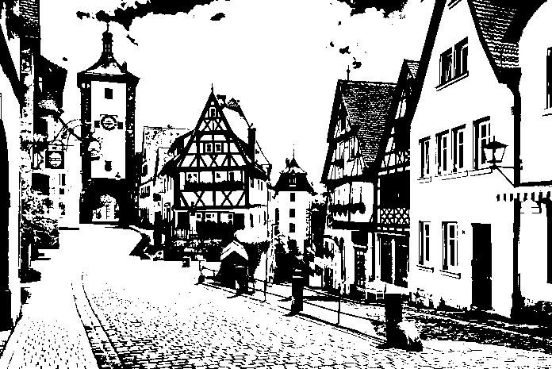
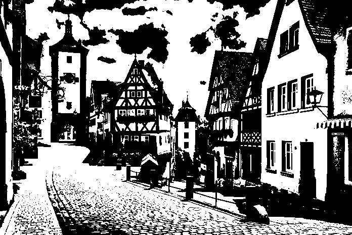

# color-quantization
> Color quantization zoo.

## Otsu's method - binarization
[Otsu's method](https://en.wikipedia.org/wiki/Otsu%27s_method) is a method for color binarization.

|Colored|Otsu's method|Median threshold|
|--|--|--|
||||
