# color-quantization
> Color quantization zoo.

## Otsu's method - binarization
[Otsu's method](https://en.wikipedia.org/wiki/Otsu%27s_method) is an algorithm for color binarization. See `otsu/`.

|Colored|Otsu's method|Median threshold|
|--|--|--|
|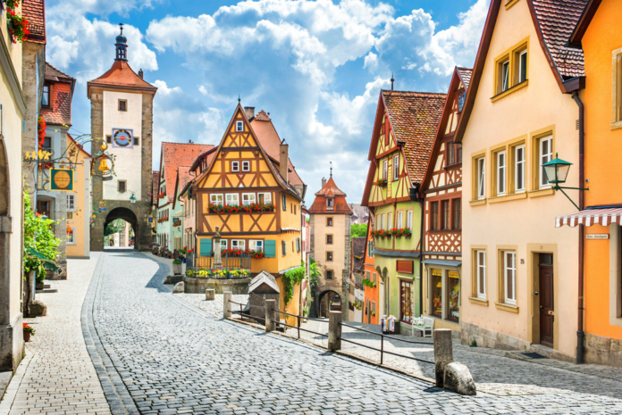|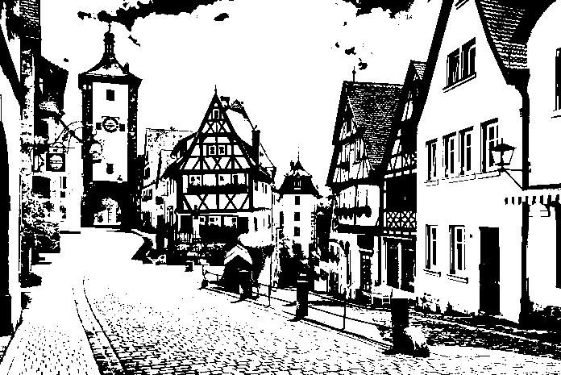|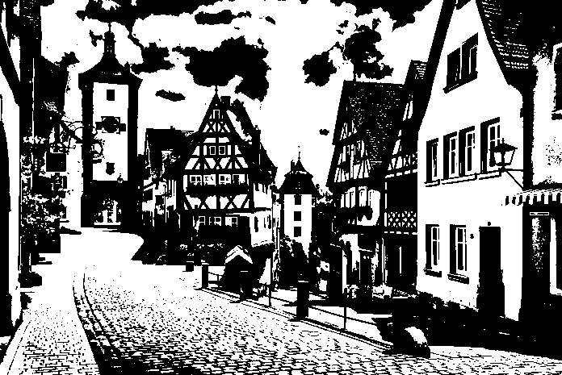|

## Median cut - quantization
[Median cut](https://en.wikipedia.org/wiki/Median_cut) is an algorithm for color quantization of images into 2n colors. See `median_cut/`.

|Original|2 color|
|--|--|
||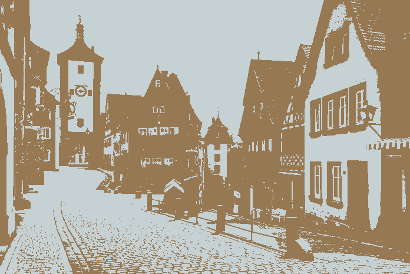|
|4 color|8 color|
|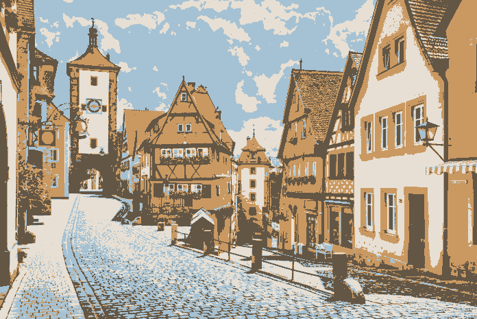|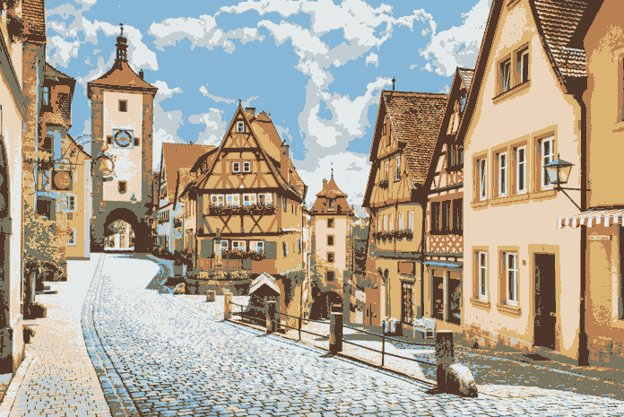|
|16 color|32 color|
|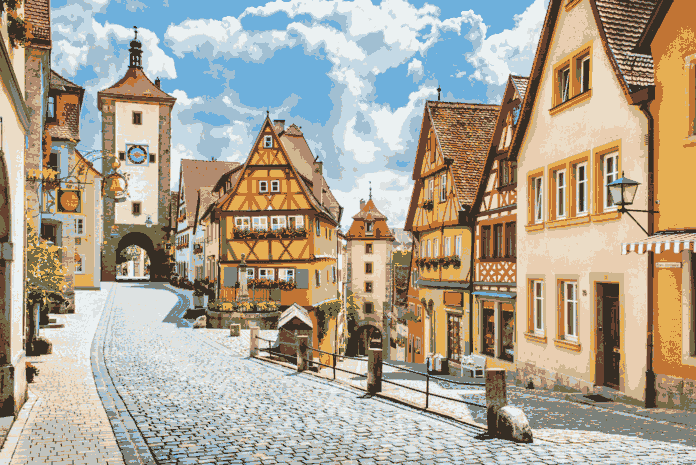||
|64 color|128 color|
|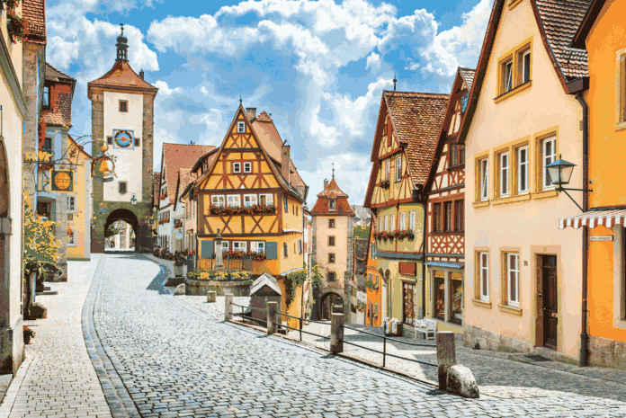||

## K-means++ - quantization
[K-means++](https://en.wikipedia.org/wiki/K-means%2B%2B) is an improved K-means algorithm with better initialization. Initializing with sparser centroids (though more computationally expensive) can lead to faster convergence. See `kmeans/`. Note that this algorithm can quantize an image to arbitrary number of colors.

|Original|2 color|
|--|--|
||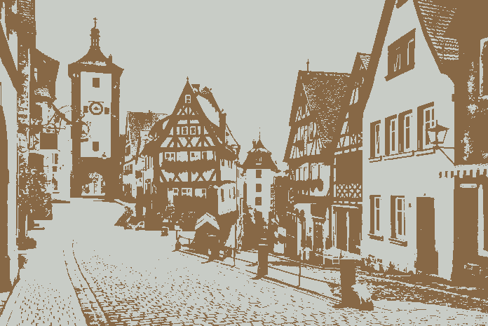|
|3 color|5 color|
|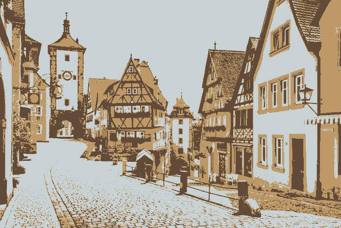|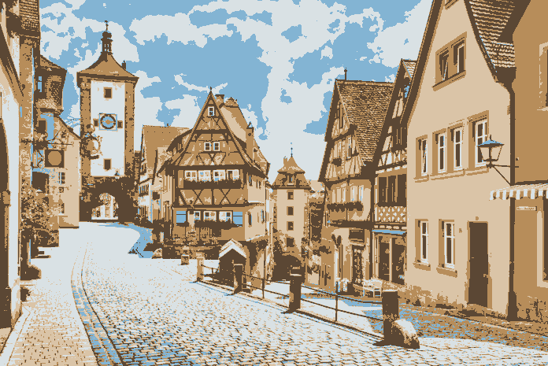|
|10 color|20 color|
|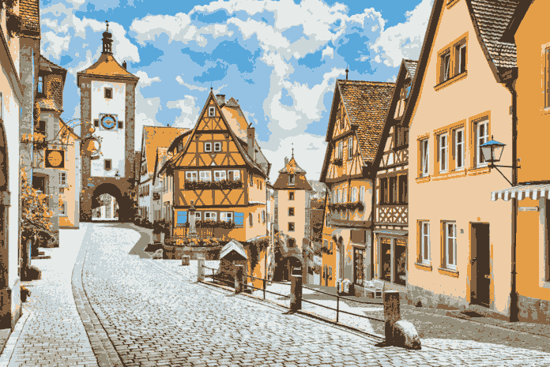|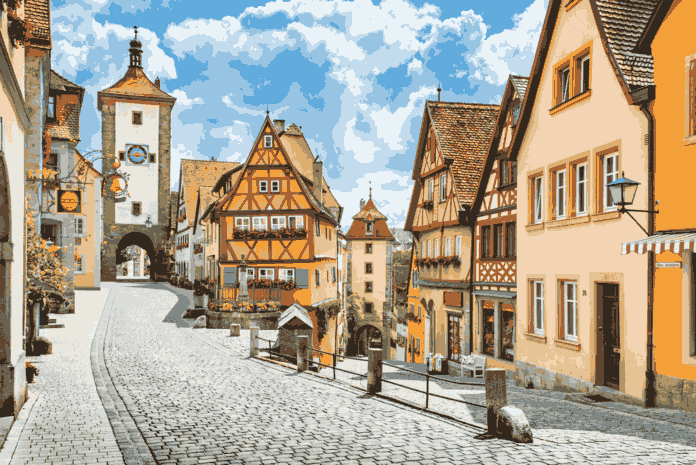|
|50 color|100 color|
||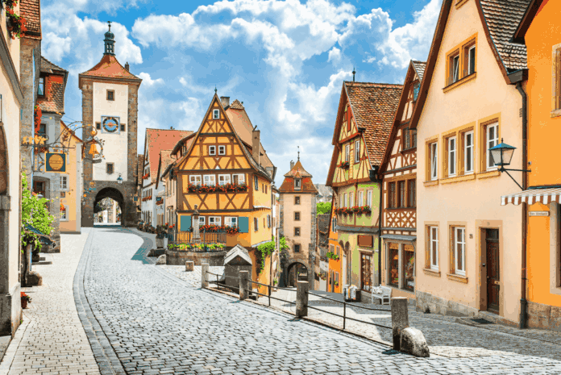|

## Octree - quantization